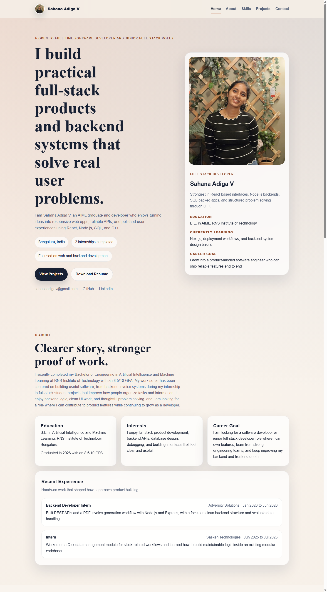

# Sahana Adiga V | Personal Portfolio

A premium, highly responsive personal portfolio website showcasing proof of work, professional experience, and full-stack projects. Designed with smooth scrolling (Lenis), clean visual animations (GSAP/ScrollTrigger), and a modern, high-contrast Slate & Indigo theme.



## Live Deployment

The portfolio is deployed live at:  
👉 **[sahanaadigav.vercel.app](https://sahanaadigav.vercel.app/)**

---

## Core Features

- **Professional Positioning**: Clear hero statement immediately declaring roles sought, core skills, and background.
- **Proof of Work**: Highlights primary projects first, complete with screenshots, list of technologies, takeaways, and links to source code and live demos.
- **Interactive Experience Timeline**: Showcases internships at Adversity Solutions and Sasken Technologies.
- **Clean Grouped Skills**: Organized categories (Languages, Frontend, Tools & Databases, and Currently Learning) focusing on technologies comfortable explaining in interviews.
- **Unified Contact & Resume Access**: Access to email, GitHub, LinkedIn, and resume (view and download options) in one single clean section.
- **Performance & Responsiveness**: Smooth inertial scrolling, custom interactive cursor, and fluid layouts optimized for mobile devices and recruiters.

---

## Featured Projects

### 1. Smart Bookmark Web App
An automated bookmark manager equipped with metadata extraction, duplicate URL filtering, and row-level security (RLS) policies.
- **Tech Stack**: React.js, Supabase, PostgreSQL, Google OAuth, Chrome Extension APIs
- **Takeaways**: Relational schema design, OAuth integrations, and real-time state synchronization.

### 2. SaaS Task Management System
A collaborative workspace platform allowing teams to manage projects inside isolated workspace "Circles" using JWT authentication.
- **Tech Stack**: React.js, Node.js, Express.js, MySQL, JWT
- **Takeaways**: Database normalization, session token state, MVC routing, and RESTful API endpoints.

### 3. Real-Time Stock Tracker
A concurrent, high-throughput systems backend capable of parsing and storing 1,000+ real-time stock price updates per second.
- **Tech Stack**: C++, Linux, Multithreading, OpenSSL, NGINX, Twelve Data API
- **Takeaways**: Thread pool implementation, socket programming, reverse proxies, and secure mTLS communication.

---

## Technologies Used

- **Frontend**: HTML5, CSS3 (Custom Variables, Flexbox, CSS Grid), JavaScript (ES6+), React.js
- **Animations**: GSAP (GreenSock Animation Platform) & ScrollTrigger, Lenis (Smooth scroll engine)
- **Tooling**: Vite (Build tool & development server)

---

## Local Development

To run the portfolio site locally on your machine:

1. **Clone the repository**:
   ```bash
   git clone https://github.com/sahanaadiga05/PORTFOLIO_main.git
   cd PORTFOLIO_main
   ```

2. **Install dependencies**:
   ```bash
   npm install
   ```

3. **Start the local development server**:
   ```bash
   npm run dev
   ```
   *Open [http://localhost:5173](http://localhost:5173) in your browser.*

4. **Build the production bundle**:
   ```bash
   npm run build
   ```
   *Compiles source code into the `dist/` folder for deployment.*

---

## Project Structure

- `index.html` — Site structure, content, meta tags, and layouts.
- `style.css` — Visual design system, variables, color scheme, media queries, and utility classes.
- `script.js` — Client-side logic, custom cursor, magnetic button states, and GSAP animations.
- `assets/` — Project screenshots, showcase videos, and logo assets.
- `public/` — Static assets served at the root (contains `assets/Sahana_Adiga_Resume.pdf`).
